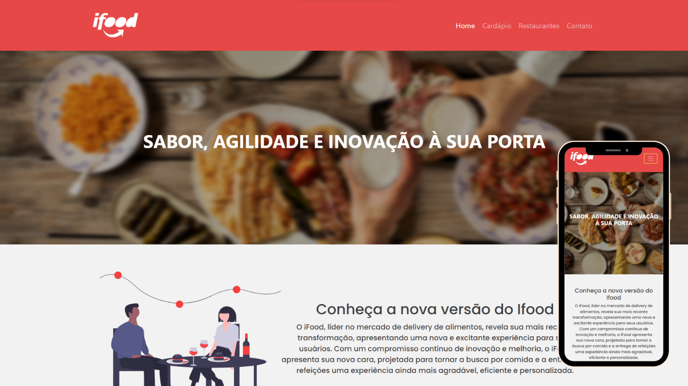

<h1 align="center"> Desenvolvimento de uma proposta de site para o Ifood #VemSerTech - Projeto final </h1>

  

 

  

## 🚀 Tecnologias

Esse projeto foi desenvolvido com as seguintes tecnologias:

- HTML e CSS
- Git e Github
- Bootstrap

## 💻 Projeto

### Desenvolvimento de uma proposta de site para o Ifood.

Neste projeto final, da turma #VemSerTech, que é uma parceria entre o iFood e a Ada, tivemos a oportunidade de aplicar todo o conhecimento adquirido em HTML e CSS para desenvolver uma proposta inovadora de website para o iFood, uma das principais plataformas de entrega de comida online. Nossa missão foi apresentar uma visão criativa e aprimorada para a renovação do iFood por meio deste projeto de website.

## 🌐 Link para visualização

https://4lisson0.github.io/projeto-front-end-estatico-ada/

## :memo: Licença

Esse projeto está sob a licença MIT.
